<h1 align="center">Hi 👋, I'm yuhan or you can also call me yh</h1>
<h3 align="center">Just building a little of something</h3>

- 🔭 I’m currently working on [gitti](https://github.com/gohyuhan/gitti)

<!-- - 👨‍💻 A full time full stack software engineer @ [swipey](https://swipey.co) -->

<h3 align="left">Connect with me:</h3>

<h3 align="left">Languages and Tools:</h3>

     

