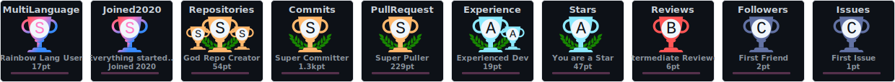
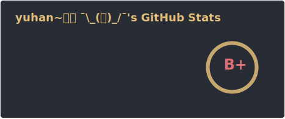
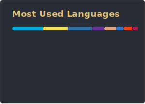

<h1 align="center">Hi 👋, I'm Yuhan (yh)</h1>
<h3 align="center">Builder of small things that (hopefully) work</h3>

<h3 align="left">🧑‍💻 About Me</h3>

A software engineer who likes to build things — sometimes useful, sometimes just for fun, always with a little too much attention to detail. I write clean code, break things occasionally, and pretend it was intentional. 🤙

  🔭 &nbsp;Currently crafting:
  <ul>
    <li>
      <a href="https://github.com/gohyuhan/gitti"><strong>gitti</strong></a>
      — a terminal UI for Git &nbsp;
      
    </li>
    <li>
      <a href="https://github.com/gohyuhan/rift"><strong>rift</strong></a>
      — tear thru your filesystem &nbsp;
      
    </li>
  </ul>

  💻 &nbsp; Full stack software engineer @ <a href="https://swipey.co">swipey</a>

  🌱 &nbsp;Always learning something new &nbsp;·&nbsp; ☕ &nbsp;Powered by caffeine

---

<h3 align="left">🤝 Connect with me</h3>

  

---

<h3 align="left">🛠️ Languages & Tools</h3>

  &nbsp;
  &nbsp;
  &nbsp;
  &nbsp;
  &nbsp;
  &nbsp;
  

---

<h3 align="left">📊 Stats</h3>

  
  &nbsp;
  

