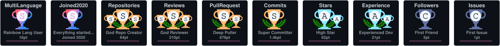
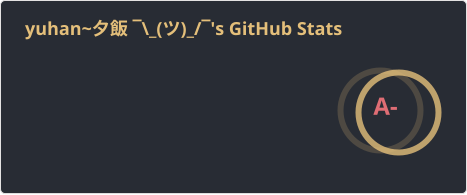
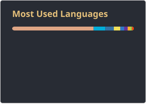

<h1 align="center">Hi 👋, I'm Yuhan (yh)</h1>
<h3 align="center">Builder of small things that (hopefully) work</h3>

<h3 align="left">🧑‍💻 About Me</h3>

A software engineer who likes to build things — sometimes useful, sometimes just for fun, always with a little too much attention to detail. I write clean code, break things occasionally, and pretend it was intentional. 🤙

🔭 <b>Currently crafting:</b>

<ul>
  <li>
    <a href="https://github.com/gohyuhan/gitti"><strong>gitti</strong></a> — a terminal UI for Git 
    
  </li>
  <li>
    <a href="https://github.com/gohyuhan/rift"><strong>rift</strong></a> — tear thru your filesystem 
    
  </li>
</ul>

💻 Full stack software engineer @ <a href="https://swipey.co">swipey</a>

🌱 Always learning something new · ☕ Powered by caffeine

---

<h3 align="left">🤝 Connect with me</h3>

  

---

<h3 align="left">🛠️ Languages & Tools</h3>

  

---

<h3 align="left">📊 Stats</h3>

  
  &nbsp;
  

<picture>
  <source media="(prefers-color-scheme: dark)" srcset="https://raw.githubusercontent.com/gohyuhan/gohyuhan/main/profile/pacman-contribution-graph-dark.svg">
  <source media="(prefers-color-scheme: light)" srcset="https://raw.githubusercontent.com/gohyuhan/gohyuhan/main/profile/pacman-contribution-graph.svg">
  
</picture>
